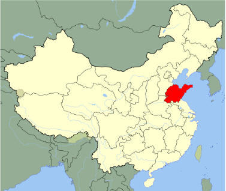
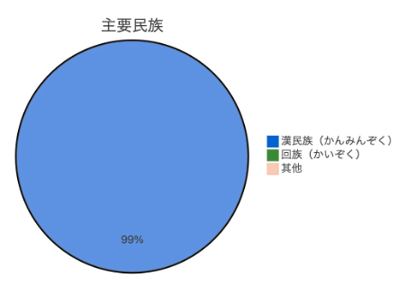
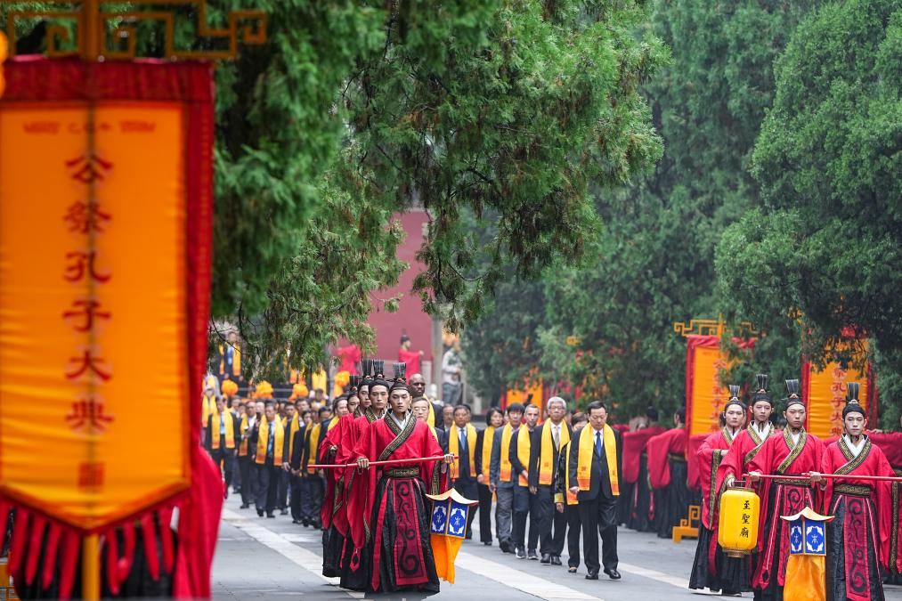

### [<ruby>山東省<rt>さんとうしょう</rt></ruby>](https://www.thechinajourney.com/ja/山東/#google_vignette)
<ruby>斉<rt>せい</rt></ruby>と<ruby>魯<rt>ろ</rt></ruby>の地、<ruby>孔子<rt>こうし</rt></ruby>の<ruby>故郷<rt>こきょう</rt></ruby>

✳︎ちなみに、世界最大の孔子<ruby>銅像<rt>どうぞう</rt></ruby>は、東京都<ruby>文京区<rt>ぶんきょうく</rt></ruby>にある[「<ruby>湯島聖堂<rt>ゆしませいどう</rt></ruby>」](http://www.seido.or.jp/whole.html)の<ruby>境内<rt>けいだい</rt></ruby>に<ruby>安置<rt>あんち</rt></ruby>されています。

     

### [<ruby>孔子<rt>こうし</rt></ruby>文化祭](https://www.youtube.com/watch?v=mrzxKLAukmI)

 