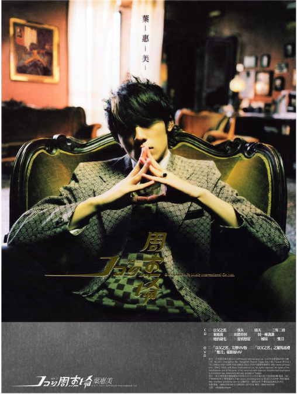
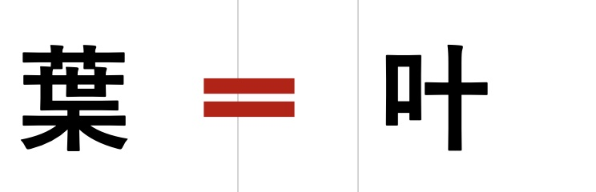
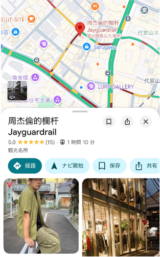
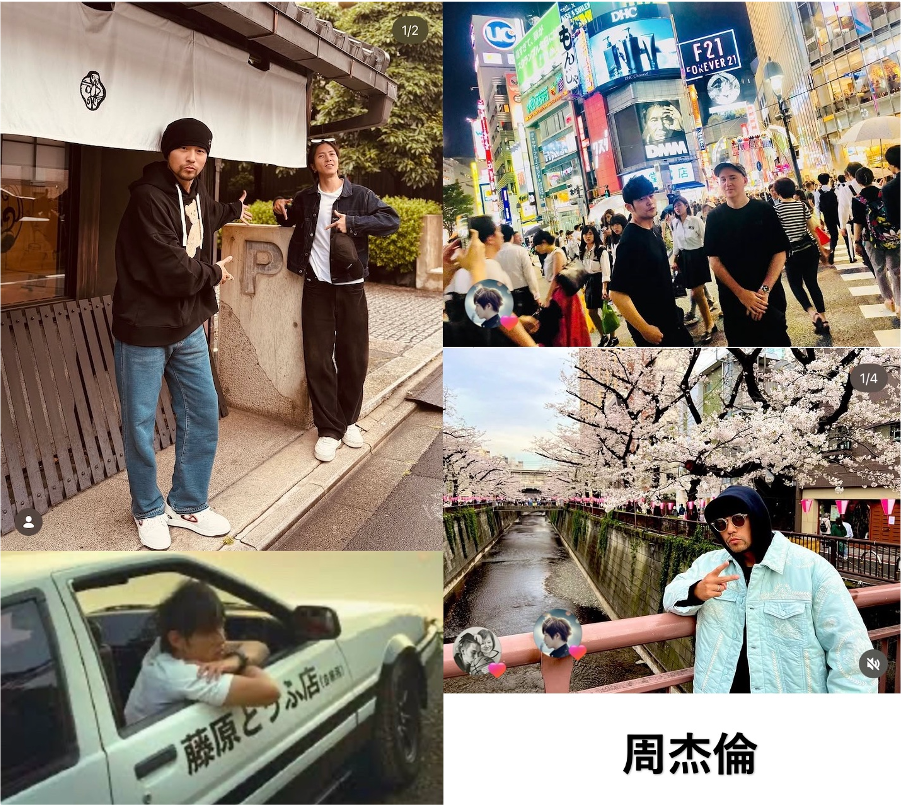
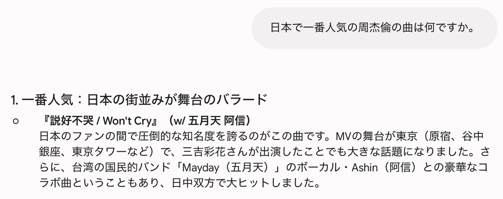
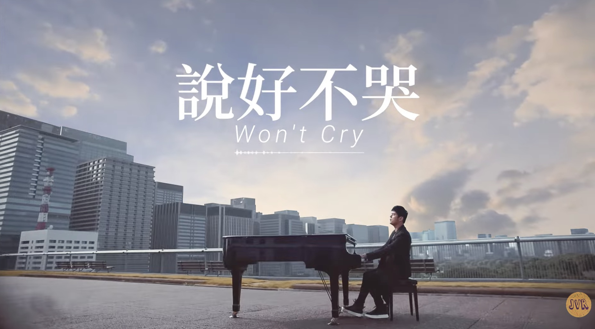
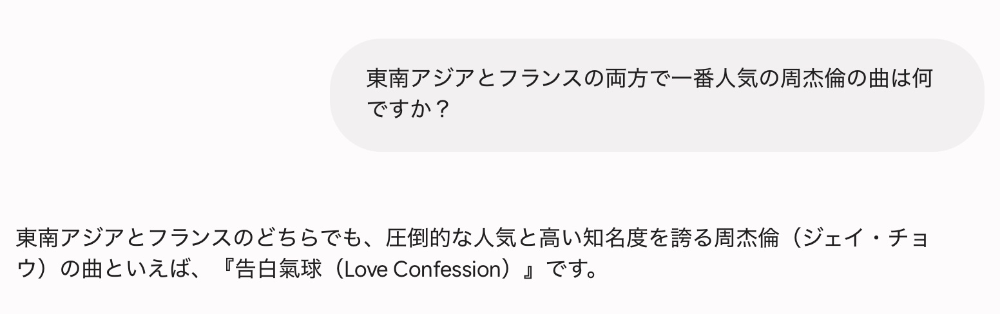
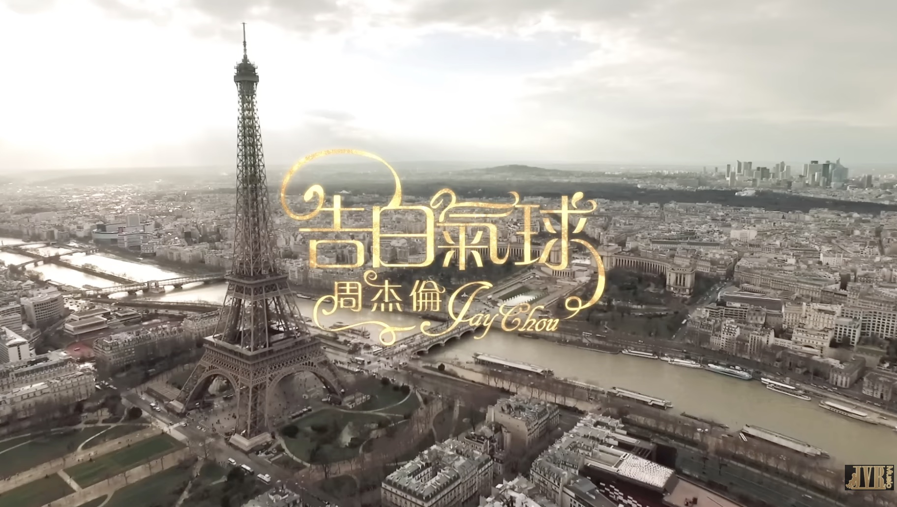

# 音楽で<ruby>繋<rt>つな</rt><ruby>がる世界：<ruby>周<rt>しゅう</rt></ruby><ruby>杰<rt>けつ</rt></ruby><ruby>倫<rt>りん</rt></ruby>（<ruby>Jay<rt>ジェイ</rt></ruby> <ruby>Chou<rt>チョウ</rt></ruby>）

## 1. <ruby>華流<rt>かりゅう</rt></ruby>音楽の<ruby>至宝<rt>しほう</rt><ruby>

* **プロフィール:** 歌手、<ruby>作曲家<rt>さっきょくか</rt></ruby>。
* **音楽スタイル:** 周氏風（ジェイ・スタイル）。ラップ、クラシック、中国の<ruby>伝統<rt>でんとう</rt></ruby>音楽の<ruby>融合<rt>ゆうごう</rt></ruby>。

## 2. 私の<ruby>視点<rt>してん</rt></ruby>

* **出会い:** 初めて聴いた曲は、アルバム「<ruby>葉恵美<rt>ようえみ</rt></ruby>」に<ruby>収録<rt>しゅうろく</rt></ruby>されている「<ruby>東風破<rt>とうふうは</rt></ruby>」です。  
[東風破-Official Music Video](https://www.youtube.com/watch?v=qct0JLjaHDc&list=OLAK5uy_luGzxd76PlO-rZN-Nh_MRoD81ukS_D7os&index=5)  

**✳︎✳︎✳︎<ruby>豆知識<rt>まめちしき</rt></ruby>✳︎✳︎✳︎**  

* 「<ruby>葉恵美<rt>ようえみ</rt></ruby>」は周杰倫の母の名前です。  
* 中国の漢字には2種類あります。それぞれ<ruby>簡体字<rt>かんたいじ<rt></ruby>と<ruby>繁体字<rt>はんたいじ<rt></ruby>と呼ばれています。簡体字と繁体字は、書き方が違うだけで意味は同じです。  
周杰倫は<ruby>台湾<rt>たいわん<rt></ruby>出身なので、台湾では繁体字が使われています。（✳︎<ruby>香港<rt>ホンコン</rt><ruby>でも繁体字が使われている）

## 3. 日本との<ruby>架<rt>か</rt></ruby>け橋

* Googleマップで「周杰倫」をキーワードに検索すれば、写真のようなフォトスポット(Photo Spot)が見つかります。  
[Googleマップ](https://www.google.com/maps/place/%E5%91%A8%E6%9D%B0%E5%80%AB%E7%9A%84%E6%AC%84%E6%9D%86Jayguardrail/@35.6489489,139.7011881,17z/data=!4m14!1m7!3m6!1s0x60188b0015823665:0x554d5ab5ffa8a2d9!2z5ZGo5p2w5YCr55qE5qyE5p2GSmF5Z3VhcmRyYWls!8m2!3d35.6489256!4d139.7012085!16s%2Fg%2F11y0cylrrx!3m5!1s0x60188b0015823665:0x554d5ab5ffa8a2d9!8m2!3d35.6489256!4d139.7012085!16s%2Fg%2F11y0cylrrx?authuser=0&entry=ttu&g_ep=EgoyMDI2MDUyNy4wIKXMDSoASAFQAw%3D%3D)  

* 日本での<ruby>足跡<rt>あしあと</rt></ruby>  
→ 山P、渋谷、目黒川、<ruby>頭<rt>かしら</rt></ruby>文字D(Initial D)  
  
 
[頭文字D_ショート動画](https://youtube.com/shorts/HhsFD1P3Zr8?si=jbInGfcCDfcqEZL6)

## 4. <ruby>国境<rt>こっきょう</rt></ruby>を<ruby>越<rt>こ</rt></ruby>える人気

* AIは、**日本**で周杰倫の一番人気の曲は「說好不哭 (泣かないと約束したから)」だと回答しました。
  
[泣かないと約束したから](https://www.youtube.com/watch?v=tM9Z8IFCdJk)  

* AIは、**東南アジア**と**フランス**の両方で周杰倫の一番人気の曲は「<ruby>告白<rt>こくはく</rt></ruby>の<ruby>風船<rt>ふうせん</rt></ruby>」だと回答しました。
  
[告白氣球 Love Confession](https://www.youtube.com/watch?v=bu7nU9Mhpyo&list=PLd98OG4c5SYU6dBM8v2t_293sgEy-9fIz)    
